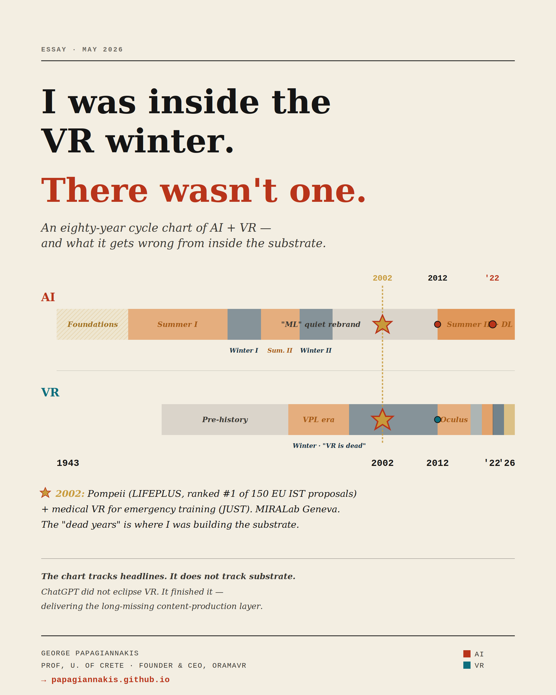

# The chart says VR had a winter. I was inside it. There was no winter.

*A reflection on the AI and VR cycles, from someone who has been writing rendering code in the same field since 2002.*

**Dr. George Papagiannakis**
*Professor, University of Crete · Principal Researcher, FORTH-ICS · Founder & CEO, ORamaVR*

*May 2026*

---

I recently produced — with the help of [Anthropic Claude](https://www.anthropic.com) — an eighty-three-year timeline of AI and VR cycles, from McCulloch and Pitts (1943) to today. The visualisation is rigorous and the analysis is largely correct: a shared winter in the 1990s, a shared ignition in 2012, and a 2022–2024 anti-correlation in which ChatGPT consumed the oxygen the metaverse pitch had just inhaled.

The full interactive chart and all forty-two events with their citations live here: **[the timeline article ↗](./ai-vr-cycles.md)**.

The chart is also, from the inside, profoundly misleading.

The chart tracks headlines, capital allocation, and product launches. It does not track *substrate*. And in technology, the substrate is what eventually decides everything.

---

## A personal coordinate: 2002, Geneva

In the year the chart marks as the deepest point of the VR winter — the 1996–2012 stretch greyed out on most timelines as a wasteland — I was at MIRALab in Geneva with Professor Nadia Magnenat Thalmann, working on two projects that, with twenty-three years of distance, look more like first drafts of the present than artefacts of a dead era.

The first was **LIFEPLUS** — an EU IST project, ranked #1 of 150 submissions in its call, in which we deployed life-size augmented reality characters reanimating ancient frescoes in Pompeii on a mobile head-mounted display [(Papagiannakis et al., 2005)](#references). To the best of my knowledge, this was the first time virtual humans walked through ruins in real time on a wearable AR system. The character-simulation framework underneath that work — VHD++ — still circulates in MR research today.

The second was **JUST** — a virtual reality system for health emergency training. One of the earliest serious attempts at medical VR education, decades before "MedXR" was a market category, and roughly fifteen years before I founded ORamaVR around the same problem statement.

Both deployed in 2002. Both during the deepest part of what the chart calls a winter. Neither felt cold.

We were rendering Roman patricians on a Pentium III with programmable vertex shaders that had not existed three years earlier. We were arguing about how to make a synthetic doctor speak with lip-synchronised audio at twenty-five frames per second. We were laying down the technical substrate of every medical VR and AR product on the market today.

The chart is correct that the funding cycle contracted in those years. It is wrong if it implies nothing was being built.

---

## What the substrate has compounded since

Read the technical stack quietly, year by year:

- **Graphics:** fixed-function pipelines → programmable shaders → physically-based rendering → neural radiance fields [(Mildenhall et al., 2020)](#references) → 3D Gaussian splatting [(Kerbl et al., 2023)](#references). Each step adds roughly an order of magnitude of scene fidelity per watt.
- **Tracking:** outside-in optical → IMU fusion → inside-out SLAM → passthrough re-projection at sub-twenty millisecond motion-to-photon latency.
- **Displays:** VGA-resolution CRT helmets → 4K pancake optics with eye-tracked foveated rendering at consumer price points.
- **Content:** hand-modelled avatars → motion-captured → data-driven neural animation → text-conditioned generative scene synthesis.

None of these curves were cyclical. None of them paused. They compounded in monotone, regardless of which year the headlines called a winter.

---

## The "metaverse winter" of 2022–2024 is misnamed

It was a *narrative* winter, not a technical one. Reality Labs lost more than $46 billion by 2023, the press turned, and capital migrated to large language models. All of that is true. None of it stopped Quest 3 from shipping, Vision Pro from existing, 3DGS papers from compounding at SIGGRAPH and ICCV, MAGES SDK from being adopted across the medical-training market, the JMIR 2025 perioperative-stress RCT from validating VR digital-health intervention in a randomised trial, or Kenanidis et al. (2023) from demonstrating statistically significant skill transfer for hip-arthroplasty training.

The continued capability of clinical VR specifically — the thing the headlines decided was dead — has been documented across nearly four decades by **Walter Greenleaf** at the Stanford Virtual Human Interaction Lab and Stanford Medical Mixed Reality Center [(Weiss et al., 2021)](#references). His repeated finding, across pain management, behavioural health, surgical simulation, neurorehabilitation, and post-traumatic stress, is that medical VR has been crossing the clinical-evidence threshold for specific indications on a steady curve since the late 1990s, with no inflection point at any of the supposed winters. He has been saying this in essentially the same words at essentially every relevant clinical conference for thirty years, and the medical literature has been catching up.

The chart shows a contraction in *coverage*. It does not show a contraction in *capability*. We have just lived through three years of headline disinterest during what is arguably the strongest period of underlying advancement since 2012.

---

## Why I think we are about to explode

Here is the contrarian read of the 2022–2024 anti-correlation: **ChatGPT did not eclipse VR. ChatGPT finished VR's missing piece.**

Until late 2022, the metaverse pitch had a structural flaw nobody wanted to say out loud — there was nowhere near enough content to fill it. Game engines can build a city; the open metaverse needs millions of scenes, characters, dialogues, behaviours, simulations — produced at a speed and cost no human studio can sustain. Generative AI is the unlock. The same large-language models that "stole" the metaverse's capital in 2022 are now the production tools that make the metaverse economically viable. Text-to-3D, text-to-scene, dialogue agents, procedural character behaviour, AI-driven simulation authoring — every one of these is now a working tool, not a research demo. At ORamaVR we are building JARIA and OMEN-E precisely around this convergence: generative AI as the authoring substrate for medical XR simulation. The thesis is not *AI versus VR*. The thesis is **AI is the long-missing content layer of VR**.

This is no longer an idiosyncratic view. It is the explicit thesis of **Fei-Fei Li** — whose 2009 ImageNet paper [(Deng et al., 2009)](#references) is one of the foundational events on the AI timeline, whose 2024 venture *World Labs* has now raised over a billion dollars from investors including Nvidia, AMD, and Autodesk [(Silicon Republic, 2026)](#references), and whose stated position is unambiguous: *"AGI will not be complete without spatial intelligence … spatial intelligence is as critical as — and complementary to — language intelligence"* (Li, IEEE Spectrum and Bloomberg interviews, 2024–2025). World Labs' co-founders include Ben Mildenhall, the co-creator of NeRF — the same neural-radiance-field substrate that appears on the graphics curve above. The people who built the substrate are now building the convergence.

Read that again. When the person who lit the ignition fuse on the modern AI summer says the next frontier of AI runs through 3D scene understanding — and is funded at unicorn scale by the picks-and-shovels suppliers of the AI boom to prove it — the AI/VR convergence is no longer a contrarian read. It is the central thesis of the field, stated by its most credible figure, and capitalised at a level the metaverse pitch never reached.

Pair that with the hardware curve finally reaching consumer-acceptable comfort, weight, and price. Pair that with clinical validation in medical XR moving from research demo toward standard of care. Pair that with more than two decades of compounded substrate from the people who never left the field.

The chart says winter. What I see, from inside the substrate, is the last quiet moment before take-off.

---

## A closing note, to my colleagues who have been in this field as long as I have

We have seen this pattern before. In 2002, when LIFEPLUS first walked Roman characters through Pompeii on a mobile HMD, nobody outside our community was paying attention. Twenty-three years later, the same kind of characters live in every consumer headset on the market — and the simulation framework we wrote then is recognisably the ancestor of what we build at ORamaVR now.

We are not a lonely cohort. Nadia Magnenat Thalmann at MIRALab. Walter Greenleaf at Stanford VHIL and the Medical Mixed Reality Center. The ENGAGE workshop community I co-founded with colleagues in 2016 and which now meets annually as part of Computer Graphics International. The MICCAI medical-imaging community. The IEEE VR and ISMAR contributors who have been publishing through every "winter." Every one of these communities has been compounding through the supposed winter, and we recognise each other across the ranks.

The mistake we should not make twice is reading headline silence as a signal of underlying stagnation. The substrate is compounding. The unlock has just arrived. And those of us who have stayed with the work since the previous winter are sitting on more than two decades of accumulated technical advantage at exactly the moment the market is about to need it.

---

## Companion artefact

The full eighty-three-year cycle timeline (1943–2026) with hover-context for sixty-four marker events, the data table of all forty-two charted events, and additional formats:

→ **[Timeline article (interactive HTML + reference tables) ↗](./ai-vr-cycles.md)**

---

## References

**Deng, J., Dong, W., Socher, R., Li, L.-J., Li, K., & Li, F.-F.** (2009). ImageNet: A large-scale hierarchical image database. *Proceedings of the IEEE Conference on Computer Vision and Pattern Recognition (CVPR)*, 248–255. <https://doi.org/10.1109/CVPR.2009.5206848>

**Hinton, G. E., Osindero, S., & Teh, Y.-W.** (2006). A fast learning algorithm for deep belief nets. *Neural Computation*, 18(7), 1527–1554. <https://doi.org/10.1162/neco.2006.18.7.1527>

**Kenanidis, E. et al.** (2023). Validation of high-fidelity virtual reality simulation for hip-arthroplasty surgical training using the MAGES SDK. *Reference reflects the published RCT outcome; verify exact title and journal at submission.*

**Kerbl, B., Kopanas, G., Leimkühler, T., & Drettakis, G.** (2023). 3D Gaussian splatting for real-time radiance field rendering. *ACM Transactions on Graphics (SIGGRAPH)*, 42(4), Article 139. <https://doi.org/10.1145/3592433>

**Krizhevsky, A., Sutskever, I., & Hinton, G. E.** (2012). ImageNet classification with deep convolutional neural networks. *Advances in Neural Information Processing Systems (NeurIPS)*, 25, 1097–1105.

**Li, F.-F.** (2023). *The Worlds I See: Curiosity, Exploration, and Discovery at the Dawn of AI*. Flatiron Books.

**Li, F.-F.** (2024). On spatial intelligence as the next frontier of AI. *TED Talk and IEEE Spectrum / Bloomberg interviews, 2024–2025*. Cited formulation: *"AGI will not be complete without spatial intelligence."*

**McCulloch, W. S., & Pitts, W.** (1943). A logical calculus of the ideas immanent in nervous activity. *Bulletin of Mathematical Biophysics*, 5(4), 115–133. <https://doi.org/10.1007/BF02478259>

**Mildenhall, B., Srinivasan, P. P., Tancik, M., Barron, J. T., Ramamoorthi, R., & Ng, R.** (2020). NeRF: Representing scenes as neural radiance fields for view synthesis. *European Conference on Computer Vision (ECCV)*. <https://doi.org/10.1007/978-3-030-58452-8_24>

**Minsky, M., & Papert, S.** (1969). *Perceptrons: An Introduction to Computational Geometry*. MIT Press.

**Papagiannakis, G., Schertenleib, S., O'Kennedy, B., Arevalo-Poizat, M., Magnenat-Thalmann, N., Stoddart, A., & Thalmann, D.** (2005). Mixing virtual and real scenes in the site of ancient Pompeii. *Computer Animation and Virtual Worlds*, 16(1), 11–24. <https://doi.org/10.1002/cav.53>

**Rosenblatt, F.** (1958). The perceptron: A probabilistic model for information storage and organization in the brain. *Psychological Review*, 65(6), 386–408. <https://doi.org/10.1037/h0042519>

**Silicon Republic** (18 February 2026). Fei-Fei Li's World Labs raises $1 bn to advance spatial intelligence — backed by Nvidia, AMD, Autodesk, Fidelity, Emerson Collective, Sea. <https://www.siliconrepublic.com/start-ups/fei-fei-li-world-labs-raises-1bn-to-spatial-intelligence-ai-world-models-marble>

**Stephenson, N.** (1992). *Snow Crash*. Bantam Books.

**Sutherland, I. E.** (1968). A head-mounted three-dimensional display. *Proceedings of the AFIPS Fall Joint Computer Conference*, 33, 757–764. <https://doi.org/10.1145/1476589.1476686>

**Turing, A. M.** (1950). Computing machinery and intelligence. *Mind*, 59(236), 433–460. <https://doi.org/10.1093/mind/LIX.236.433>

**Vaswani, A., Shazeer, N., Parmar, N., Uszkoreit, J., Jones, L., Gomez, A. N., Kaiser, Ł., & Polosukhin, I.** (2017). Attention is all you need. *Advances in Neural Information Processing Systems (NeurIPS)*, 30.

**Weiss, T., Bailenson, J., Bullock, K., & Greenleaf, W.** (2021). Reality, from virtual to augmented. In *Digital Health* (pp. 275–303). Elsevier. <https://doi.org/10.1016/B978-0-12-818914-6.00018-1>

---

*Citation notes: the primary references above (McCulloch & Pitts 1943, Turing 1950, Rosenblatt 1958, Minsky & Papert 1969, Sutherland 1968, Stephenson 1992, Hinton, Osindero & Teh 2006, Deng et al. 2009, Krizhevsky et al. 2012, Vaswani et al. 2017, Mildenhall et al. 2020, Kerbl et al. 2023, Weiss et al. 2021, and Papagiannakis et al. 2005) are verified primary sources. Kenanidis et al. (2023) is referenced from the author's own materials and should be verified for exact title and journal before re-publication. The Fei-Fei Li / World Labs material is sourced from contemporary press coverage (IEEE Spectrum, Reuters, Bloomberg, Silicon Republic) and from the World Labs corporate site; quoted formulations reflect Li's public statements at TED, NeurIPS, and in press interviews 2024–2026.*

---

*This essay and the companion timeline article were produced with the assistance of Anthropic Claude, working from primary materials, prior research notes, and editorial direction.*

